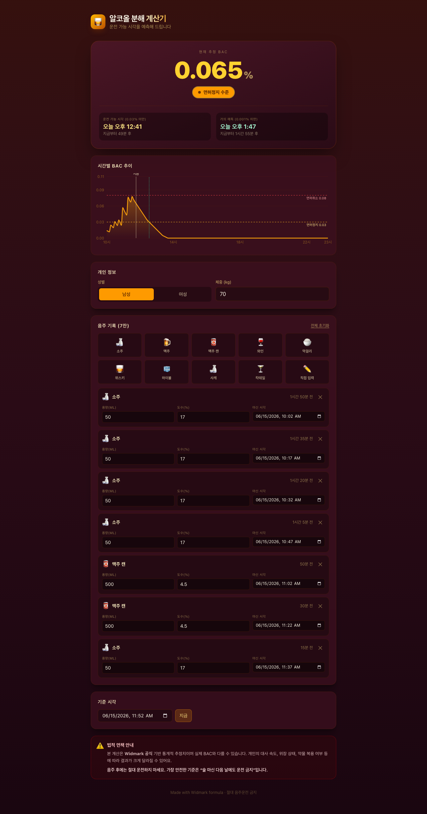

# 🥃 알코올 분해 계산기

> Widmark 공식으로 혈중알코올농도(BAC)를 추정하고, **운전 가능 시각**을 예측해주는 실용 웹앱


## 🔗 라이브 데모

**👉 [https://alcohol-bac-calculator.vercel.app](https://alcohol-bac-calculator.vercel.app)**



## ✨ 주요 기능

- 🍶 **9가지 음료 프리셋** — 소주 · 맥주 · 와인 · 막걸리 · 위스키 · 하이볼 · 사케 · 칵테일 · 직접입력
- 📊 **실시간 BAC 추정** — Widmark 공식 + 시간당 0.015% 분해율 적용
- 🚗 **운전 가능 시각 예측** — 도로교통법 기준(0.03%) 미만으로 떨어지는 시각을 분 단위로 계산
- 📈 **시간별 BAC 그래프** — 면허정지·취소 기준선과 함께 BAC 감소 곡선 시각화 (recharts)
- 🚨 **위험도 컬러 시그널** — 면허취소(빨강) / 면허정지(앰버) / 안전(에메랄드) 3단계 즉시 식별
- ⏱ **잔별 시각·도수·용량 수정** — 프리셋 기본값에서 자유롭게 커스터마이즈
- 💾 **localStorage 영속화** — 새로고침해도 입력값 유지
- 🌙 **다크 버건디 × 앰버 무드** — 술집 분위기의 다크 와인 테마

## 🍷 디자인 컨셉

깊은 와인 레드 배경(`#3D0F1F` · `#2A0B16`)에 위스키 앰버(`#F59E0B`)와 크림 텍스트(`#FEF3C7`)를 더한 **다크 버건디 × 앰버** 팔레트. 위험 상태에 따라 배경 그라데이션이 부드럽게 변하며, Pretendard 한글 폰트로 깔끔하게 마감.

## 🧮 계산 공식

```
순수 알코올량 (g) = 용량(ml) × 도수(%)/100 × 0.789
초기 BAC (%)    = (알코올 g / (체중 kg × r × 1000)) × 100
                  r = 남성 0.68, 여성 0.55
현재 BAC        = max(0, 초기BAC - 0.015 × 경과시간(h))
```

각 잔의 기여도를 합산하고, 이분 탐색으로 임계값(0.03%) 미만이 되는 시각을 분 단위로 산출합니다.

## 🛠 기술 스택

- **React 19** + **TypeScript 5** — UI
- **Vite 7** — 번들러
- **Tailwind CSS v4** — 스타일링 (`@tailwindcss/vite` 플러그인)
- **Recharts 3** — BAC 추이 차트
- **Pretendard** — 한글 폰트

## 💻 로컬 실행

```bash
npm install
npm run dev      # 개발 서버
npm run build    # 프로덕션 빌드
npm run preview  # 빌드 미리보기
```

## ⚠️ 면책 조항

본 계산은 **Widmark 공식 기반의 통계적 추정치**이며 실제 BAC와 다를 수 있습니다. 개인의 대사 속도·위장 상태·약물 복용 여부 등에 따라 결과가 크게 달라질 수 있습니다.

**음주 후에는 절대 운전하지 마세요.** 가장 안전한 기준은 "술 마신 다음 날에도 운전 금지"입니다.
